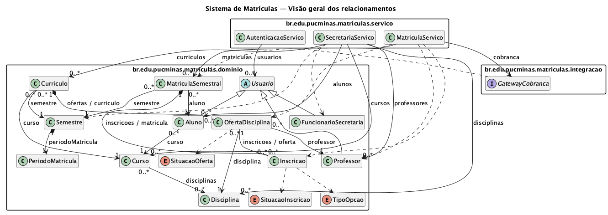

# Projeto estrutural — Lab01S02

## Diagrama de classes

A visão geral facilita a leitura dos relacionamentos. O diagrama completo contém os atributos, construtores, métodos, visibilidades, tipos e multiplicidades de todos os 19 tipos Java modelados.



- [Diagrama completo com atributos e métodos (PNG, ampliar para ler)](./classes.png)
- [Detalhamento do domínio](./classes-dominio.png)
- [Detalhamento dos serviços e da integração](./classes-servico.png)
- [Fonte do diagrama completo](./classes.puml)
- [Definições compartilhadas das classes](./classes-modelo.puml)

## Responsabilidades

| Pacote | Tipos e responsabilidade |
| --- | --- |
| `dominio` | `Usuario` (abstrato), `Aluno`, `Professor`, `FuncionarioSecretaria`: identidade e perfis. |
| `dominio` | `Curso`, `Disciplina`: catálogo acadêmico. |
| `dominio` | `Semestre`, `PeriodoMatricula`, `Curriculo`, `OfertaDisciplina`: planejamento semestral e disponibilidade. |
| `dominio` | `MatriculaSemestral`, `Inscricao`: escolhas e vínculo do aluno com as ofertas. |
| `dominio` | `TipoOpcao`, `SituacaoOferta`, `SituacaoInscricao`: valores fechados das categorias e situações. |
| `servico` | `AutenticacaoServico`, `SecretariaServico`, `MatriculaServico`: coordenação dos casos de uso e autorização dos perfis. |
| `integracao` | `GatewayCobranca`: contrato de saída para o sistema externo de cobranças. |

Os serviços dependem do domínio. `MatriculaServico` recebe uma implementação de `GatewayCobranca` por construtor. Não há banco de dados, interface gráfica, framework ou implementação do sistema externo nesta entrega.

## Leitura dos relacionamentos

- `Usuario` é a superclasse abstrata dos três perfis humanos; o sistema externo de cobranças não é um usuário local.
- Um aluno pertence a um curso. Uma disciplina pode integrar vários cursos. As coleções começam vazias para permitir a montagem dos cadastros; um curso pronto para oferta deve possuir disciplinas.
- Cada semestre possui um período. Cada currículo pertence a um curso e semestre, com unicidade desse par.
- O currículo compõe suas ofertas. Cada oferta referencia uma disciplina do curso e um professor. As referências de volta (`curriculo`, `matricula`, `oferta`) estão indicadas nos atributos.
- A matrícula semestral pertence a um aluno e semestre, com unicidade desse par; compõe suas inscrições. Uma inscrição pertence a uma oferta e tem uma categoria e uma situação.
- `0..*` nas coleções de inscrições inclui o histórico de cancelamentos. RN03 limita as inscrições **vigentes** a 4 + 2 por matrícula; RN05 limita as **vigentes** a 60 por oferta. Esses limites não são a cardinalidade do histórico inteiro.
- A composição expressa pertencimento e ciclo de vida conceitual; não determina exclusão física de registros históricos.

## Contratos dos métodos

As assinaturas detalhadas estão no UML e os contratos estão nos comentários Java. Todos os métodos de negócio são stubs com `UnsupportedOperationException`, inclusive autenticação, consultas e notificações. Os construtores apenas inicializam os atributos e as coleções; não executam validações de negócio. Métodos abstratos de integração declaram o contrato sem corpo.

`realizarMatricula` recebe listas de novas escolhas, que serão somadas às inscrições vigentes. A implementação futura deve validar o lote inteiro antes de efetuar alterações, manter a mesma inscrição nas coleções da matrícula e da oferta e notificar a cobrança somente após o sucesso. Os identificadores das novas matrículas e inscrições serão atribuídos pela implementação do serviço na Sprint 03.

As operações dos serviços pressupõem uma identidade autenticada; receber um objeto do tipo `Aluno` ou `FuncionarioSecretaria` não implementa autorização por si só. A autenticação e a verificação de titularidade/responsabilidade estão previstas nos contratos para a Sprint 03.

O encerramento percorre todos os currículos do semestre, avalia cada oferta e cancela as inscrições de ofertas inviáveis. `EM_MATRICULA` permanece a situação de uma oferta lotada antes do encerramento: a capacidade bloqueia novas inscrições. `ATIVA` indica confirmação após o encerramento, não disponibilidade para matrícula.

## Gerar as imagens novamente

Com Java e o JAR do PlantUML 1.2025.4 (usado nesta entrega), a partir da raiz:

```sh
PLANTUML_LIMIT_SIZE=16384 java -Djava.awt.headless=true -jar /caminho/plantuml.jar -charset UTF-8 -tpng Artefato/casos-de-uso.puml Artefato/classes.puml Artefato/classes-visao-geral.puml Artefato/classes-dominio.puml Artefato/classes-servico.puml
```

O limite de tamanho acima evita recortar os diagramas maiores na exportação para PNG. As fontes usam o mecanismo Smetana, dispensando instalação de Graphviz. `classes-modelo.puml` é incluído pelos diagramas e não deve ser renderizado isoladamente. As imagens PNG estão versionadas para leitura direta no GitHub.
